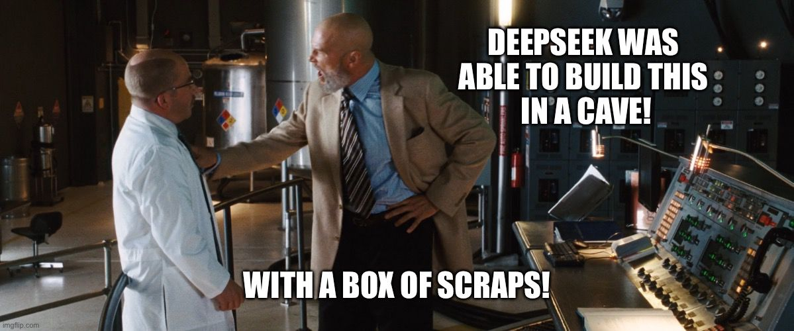

---
date:
  created: 2025-01-28
tags:
  - Qdrant
  - OpenAI
authors:
  - myriel
hide:
  - navigation
---
# GPT is Dead: The Rise of DeepSeek

!!! warning annotate "It's not just GPT, or Llama or Qwen"

    It's the entire idea that you have to spend $60-100 million on a frontier model.

[**DeepSeek-V3**](https://huggingface.co/deepseek-ai/DeepSeek-V3) cost $6 million and roughly 2.8m GPU hours. That makes models like GPT-4o or Llama 3.1 at least 10x expensive. Even [**Andrej Karpathy**](https://x.com/karpathy/status/1872362712958906460?lang=en) had to chime in:

DeepSeek-V3 is a mixture-of-experts (MoE) transformer that comprises 671 billion parameters, and 37B of those are active for each token. The team trained the model in less than a 1/10 of what it [**took to train Llama 3.1**](https://build.nvidia.com/meta/llama-3_1-405b-instruct/modelcard). 

By launching this model in late December 2024, DeepSeek has redefined the standard for Large Language Models.

Engineering is all about solving big problems with less resources. That's exactly what DeepSeek's young engineers did...and they wrote [**a world-class academic report**](https://arxiv.org/pdf/2412.19437). 

## The real world is not a Jupyter Notebook

For those of you not living in Production Land - just a reminder: Working with LLMs costs a lot of compute. Just a basic hosted GPU can start at $500 on GCP. Experimenting with compute-heavy applications can quickly add up.
 

In all of this hype, DeepSeek has reminded us what peak performance looks like. In the first 15 days of using V3, here is the compute bill for an enterprise-scale user:

{ align=left }

Just for reference - a simple request is 500 tokens. A codebase search is around 50,000. 

274,000,000 tokens is a lot of LLM. Most likely for some type of an agentic system where a model accesses multiple tools and keeps watch over its own results. 

DeepSeek's cost is a far cry from what we've seen on the customer side - with tens of thousands of dollars being spent on corporate experiments. 

**Here is a comparison with GPT-4o on Azure [(source)](https://www.reddit.com/r/LocalLLaMA/comments/1hmxjbn/deepseek_is_better_than_4o_on_most_benchmarks_at/):**

> This is what competition looks like.

## Let's look at the benchmarks

A meta-analysis of DeepSeek's own benchmark results can be compiled from the report's findings. DeepSeek-V3 is the best across all domains. **This sounds too good to be true.**

Users are already stress testing DeepSeek-V3. Though we are only four-weeks in, I found a great [**hands-on report by Sunil Kumar Dash from Composio**](https://composio.dev/blog/notes-on-new-deepseek-v3/).

His conclusions:

| Category          | Best Model           | Second Best        | Third Best      |
|------------------|---------------------|-------------------|----------------|
| Reasoning       | **Deepseek-V3**      | Claude 3.5 Sonnet | OpenAI GPT-4o  |
| Math           | **Deepseek-V3**      | Claude 3.5 Sonnet | OpenAI GPT-4o  |
| Coding         | **Claude 3.5 Sonnet** | Deepseek-V3       | OpenAI GPT-4o  |
| Creative Writing | **Claude 3.5 Sonnet** | Deepseek-V3       | OpenAI GPT-4o  |

Though its reasoning capabilities are not beyond O1, the Chinese model holds its own against GPT-4o and Claude. Moreover, its Chain of Thought reasoning works well. 

## Yes - it does pass the "strawberry" question. 

*No - it isn't as consistent across all domains. In practice - it isn't perfect.*

All of this checks out with the average user experience reported on [r/LocalLlama](https://www.reddit.com/r/LocalLLaMA/comments/1i2y810/is_deepseek_v3_overhyped/), where DeepSeek-V3 is a major source of hype. 

!!! note "Recoil42, a top commenter on this subreddit"

    *The catch is cost. Deepseek offers maybe 75% of the performance as Sonnet but at a very small fraction of the cost. It was trained at a very small fraction of the cost, and asks users for a small fraction of the cost. That's why it's in a league of its own. I used Cline last night and maybe thirty minutes of casual coding clocked me 1.50 dollars. Two hours of DeepSeek usage clocked me maybe 15 cents. It's not even close.*

    *Sonnet is better. Definitely, concretely better. It solves problems for me that leave DeepSeek spinning in circles. But the cost-efficiency of DeepSeek is a crazy eyebrow-raiser — it is cheap enough to be effectively used unmetered for most people.*

    *These days I default to DeepSeek and only tag Sonnet into the ring when a problem is particularly difficult to solve. For writing boilerplate, doing basic lookup, and writing simple functions — DeepSeek is unmatched.*
   

## The general-purpose LLM for enterprises

In my first year of working with enterprise services for vector databases, I learned how valuable open-source is for business.

> The use cases are not that complex - **but the data must stay private**.

Though Database as a Service is well known by this point, many users opt for **Bring Your Own Cloud offerings**, mostly due to compliance conflicts. 

This is why I believe that DeepSeek-V3 is the heavy hitter for 2025. We are **in the world of production** now and GenAI systems built with OS components are about to start scaling. They will cost a lot of money.

## All you need is memory

DeepSeek-V3 is rough around the edges - but this does not matter when you use a [**vector database**](https://qdrant.tech) like Qdrant. 

Feeding DeepSeek-V3 relevant context beyond its 128K context window is the ultimate RAG scenario. **But you already know about RAG, and you most certainly know about Qdrant**.

## Tutorial

[**Qdrant prepared a minimal code implementation**](https://github.com/qdrant/examples/blob/master/rag-with-qdrant-deepseek/deepseek-qdrant.ipynb) for you to copy and scale as part of your system. Give it a try and report back to me. 

*I'd like to know about your total cost, response accuracy and system scalability.*

Feel free to reach out to me via [**GitHub**](https://www.github.com/davidmyriel/) or publicly on social [LinkedIn](https://www.linkedin.com/in/davidmyriel/). 

